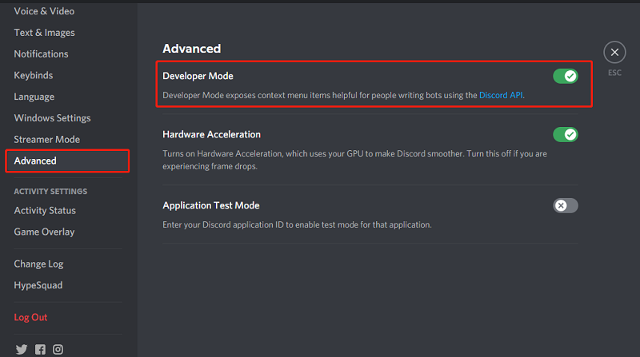
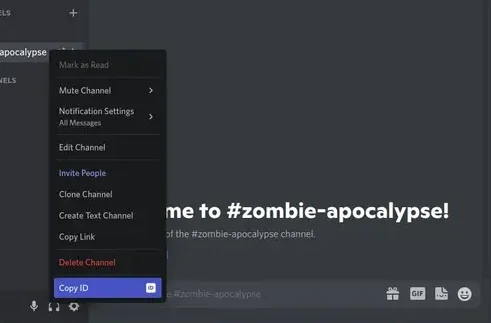
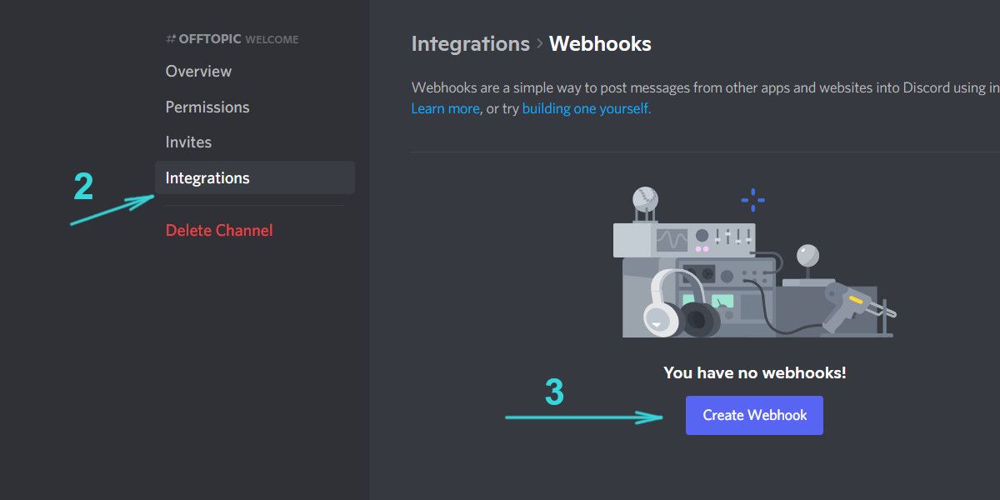

Setup
----------

notice : for good OPSEC don t use main acc

Discord Part:
------------

1-first enable developer mode via settings:

2-create a Discord server and add a bot to the server if you don t know how see:
https://opensource.com/article/22/10/matrix-discord-bot
or
https://youtu.be/Oy5HGvrxM4o?feature=shared

3-create a random chat channel (can be any chat channel on your sever),right click the channel and copy id 

4-create a webhook for that same channel if you dont know how see:

more reference:
https://progr.interplanety.org/en/how-to-get-the-discord-channel-webhook-url/

Telegram Part:
----------

1-create 2 telegram bots and get their tokens if you dont know how see : 
https://www.youtube.com/watch?v=F2-RuyIroFw&ab_channel=TheSchoolofDigitalMarketing

2-create a telegram channel and add the 2 bot to it as administrators:
To create your own channel, open the “New Message” menu on Telegram and choose “New Channel”. Newly created channels start as private – but you can edit their profile to make them public.

then the web version of telegram :https://web.telegram.org

go to your created channel ,and copy the id should look like this :

be sure to add -100 at the start it while inputing to telecord ,example: -1002544544878454 (just a random id)

thats it you r done , now you should have 1 Discord bot token ,1 Discord channelid  ,1discord webhook,2 telegram bot tokens and a telegram channelid (-100XXXXXXXXXXX)

when you run Telecord for first time it will prompt you for them ,to add and preserve other profiles orsettings , just rename the config.yaml and run telecord once more

